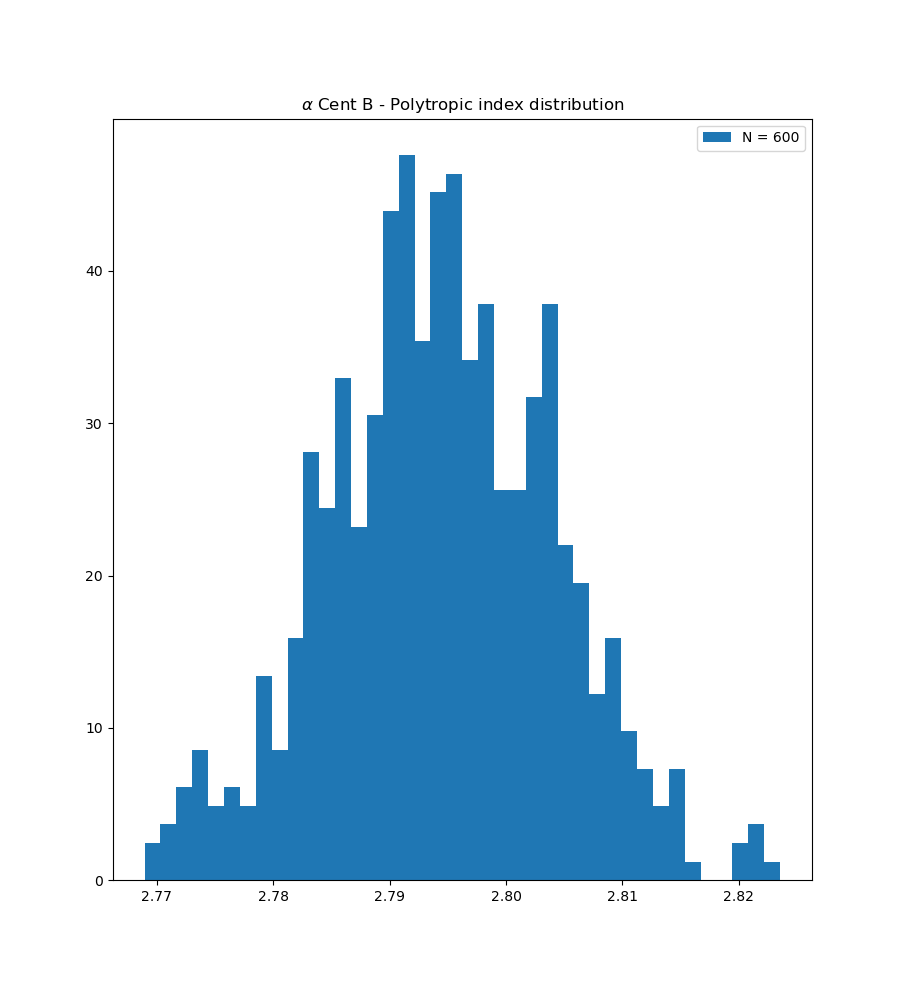

# Simulation of stellar polytrope model

## Aim

We aim to systematically estimate polytropic index of main sequence stars by simulating stellar structure from given observed data (mass, radii, luminosity and chemical composition).

## Code Structure

The code consists of a general class Poly in poly.py which holds the information of a given system. Care need to be taken on the order of methods called, lest the system's state vary and information be lost.

Some core methods are:

- get_poly: returns polytropic model information for given n
- get_params: returns parameters (temperature, pressure, density, mass) parameterized by radius
- get_luminosity: integrated luminosity over all radii
- get_data: quick method to calculate all data for given n
- get_n: shooting method to get n based on luminosity
- plot_X_vs_Y: quick plots of parameters X and Y
- get_lum: calculate luminosity for given n (used for shooting method)

Applications of the code are found in applications.py, along with Monte Carlo repeated sampling simulations for uncertainty estimation.
